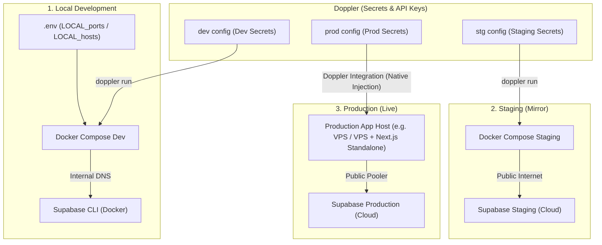

# Fintral — Guide & Architecture Map for Environments

This document details the architecture, secret management, and commands required to run and deploy **Fintral** in different environments: **Local Development**, **Staging**, and **Production**.

---

## 🗺️ Architecture & Secret Flow Map

The diagram below illustrates how Doppler feeds configurations to each environment and how services are routed.



---

## 📊 Environment Matrix

| Feature / Setting | 1. Local Development | 2. Staging | 3. Production |
| :--- | :--- | :--- | :--- |
| **`ENVIRONMENT`** | `DEVELOPMENT` | `STAGING` | `PRODUCTION` |
| **Secrets Source** | Doppler (`dev` config) | Doppler (`stg` config) | Doppler (`prod` config) |
| **Ports & Hosts Source**| Local `.env` file | Doppler (`stg` config) | Doppler (`prod` config) |
| **Database (PostgreSQL)**| Local (`supabase_db_fintral-dev:5432` / `localhost:54322`) | Staging Supabase Cloud (Direct/Pooled) | Production Supabase Cloud (Pooled/Transaction) |
| **Auth & Storage** | Local Supabase CLI | Staging Supabase Project | Production Supabase Project |
| **Email (Resend)** | Resend API Key (Dev Mode / Self-emailing) | Resend API Key (Sandbox) | Resend API Key (Production domain verified) |
| **Orchestration** | `just dev-up` / `just dev-down` | `just staging-up` / `just staging-down` | Native Platform / Docker Compose |

---

## 🛠️ Step-by-Step Setup Guides

### 1. Local Development Setup
Run everything locally in Docker containers, utilizing the Supabase CLI for the database and authentication.

#### Prerequisites:
1. **Docker + Docker Compose**
2. **Node.js (for `npx` execution)**
3. **Doppler CLI** (authenticated with `doppler login`)

#### Step-by-Step:
1. **Link your local repository to Doppler**:
   ```bash
   doppler setup --project fintral --config dev
   ```
2. **Review your local `.env`** (make sure ports like `LOCAL_PROXY_PORT=8001` do not conflict with other services running on your machine).
3. **Start the environment**:
   ```bash
   just dev-up
   ```
   *This starts the local Supabase services via `npx -y supabase start`, then pulls secrets from Doppler and spins up Nginx, Redis, Backend, and Frontend containers.*
4. **Shutdown the environment**:
   ```bash
   just dev-down
   ```

---

### 2. Staging Environment Setup
Staging mirrors the production topology but runs on a separate staging config using cloud services.

#### Prerequisites:
1. **Doppler CLI** (authenticated)
2. **Staging cloud services setup** (Staging Supabase project created, DB credentials configured in Doppler `stg`).

#### Step-by-Step:
1. **Link your local repository to Doppler staging**:
   ```bash
   doppler setup --project fintral --config stg
   ```
2. **Start Staging containers**:
   ```bash
   just staging-up
   ```
   *This loads staging configurations from Doppler and spins up `docker-compose.staging.yml`.*
3. **Shutdown Staging**:
   ```bash
   just staging-down
   ```

---

### 3. Production Environment Deployment
In production, you do not use local `.env` files. All variables (secrets + infrastructure topology) are stored in Doppler's `prod` config.

#### Recommended Deployments:

#### Option A: Docker Compose Deployment (Self-Hosted VPS)
1. Install Docker and Doppler CLI on the host server.
2. Authenticate the server with a **Doppler Service Token** (`DOPPLER_TOKEN`).
3. Run the container stack:
   ```bash
   doppler run -- docker compose -f compose.yml up -d --build
   ```

#### Option B: Cloud Hosting Platforms (e.g. Render, Railway, AWS, Heroku)
1. Configure Doppler's **Native Integration** with your cloud provider (Vercel, Render, Railway, etc.).
2. Doppler will automatically sync and inject the environment variables into the platform settings at build-time and runtime.
3. Deploy the Next.js frontend as a standalone node build and the FastAPI backend as a Docker image or Python service.
